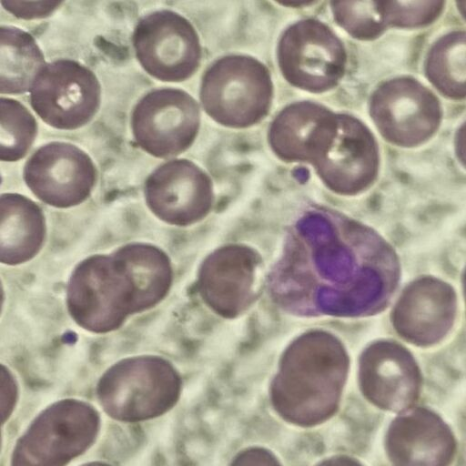

<h2>TensorFlow-FlexUNet-Image-Segmentation-KRD-WBC-White-Blood-Cell (2025/08/07)</h2>

This is the first experiment of Image Segmentation for KRD-WBC White Blood Cell Multiclass,
 based on our 
TensorFlowFlexUNet (TensorFlow Flexible UNet Image Segmentation Model for Multiclass) 
and a 512x512 pixels 
<a href="https://drive.google.com/file/d/1sriI2gBrpCYVOTLpndlXPK3VQnCgthWL/view?usp=sharing">
<b>Augmented-KRD-WBC-ImageMask-Dataset.zip</b></a>
with colorized masks (Neutrophil:green, Lymphocyte:blue, Monocyte:red, Eosinophil:cyan, Basophil:yellow).
which was derived by us from 
<a href="https://data.mendeley.com/datasets/jzdj6h7gms/2">
<b>
Creating a white blood cell dataset for segmentation
</b>
</a>
 
 
<b>Acutual Image Segmentation for 512x512 KRD-WBC images</b> 

As shown below, the inferred masks predicted by our segmentation model, which was trained on 
the augmented dataset, 
appear similar to the ground truth masks in shape, but differ in color.
 

 

 
<table>
<tr>
<th>Input: image</th>
<th>Mask (ground_truth)</th>
<th>Prediction: inferred_mask</th>
</tr>
<tr>
<td></td>
<td></td>
<td></td>
</tr>
<tr>
<td></td>
<td></td>
<td></td>
</tr>
<tr>
<td></td>
<td></td>
<td></td>
</tr>
</table>

 
<h3>1. Dataset Citation</h3>
The dataset used here has been taken from the web-site: 
<a href="https://data.mendeley.com/datasets/jzdj6h7gms/2">
<b>
Creating a white blood cell dataset for segmentation
</b>
</a>
 
 
<b>Published:</b>  9 August 2023 | Version 2 | DOI: 10.17632/jzdj6h7gms.2 
<b>Contributors:</b> Haval Taha, Fattah Alizadeh, Nawsherwan Mohammad
 
 
<b>Description</b> 
The KRD-WBC dataset consists of 600 images, each sized at 512x512 pixels, accompanied by corresponding ground truth 
images of the same dimensions. The dataset was gathered from Nanakali and Bio lab in Erbil city, 
located in the Kurdistan region of Iraq. It includes images of White Blood Cells (WBCs) 
categorized into five distinct subtypes: Neutrophils, Lymphocytes, Monocytes, Eosinophils, and Basophils. 
This dataset is valuable for medical and biological research, enabling the study and analysis of different WBC subtypes.
 
 
<b>Licence</b> 
CC BY 4.0 
 
 

<h3>
<a id="2">
2 KRD-WBC ImageMask Dataset
</a>
</h3>
 If you would like to train this KRD-WBC Segmentation model by yourself,
 please download the dataset from the google drive  
<a href="https://drive.google.com/file/d/1sriI2gBrpCYVOTLpndlXPK3VQnCgthWL/view?usp=sharing">
<b>Augmented-KRD-WBC-ImageMask-Dataset.zip</b></a>.
 
, expand the downloaded ImageMaskDataset and put it under <b>./dataset</b> folder to be
<pre>
./dataset
└─KRD-WBC
    ├─test
    │   ├─images
    │   └─masks
    ├─train
    │   ├─images
    │   └─masks
    └─valid
        ├─images
        └─masks
</pre>
 
<b>KRD-WBC Statistics</b> 
 
 
<!--
On the derivation of the dataset, please refer to the following Python scripts: 
<li><a href="./generator/ImageMaskDatasetGenerator.py">ImageMaskDatasetGenerator.py</a></li>
<li><a href="./generator/split_master.py">split_master.py</a></li>
 
-->
As shown above, the number of images of train and valid datasets is large enough to use for a training set of our segmentation model.
 
 
<b>Train_images_sample</b> 

 
<b>Train_masks_sample</b> 

 
<h3>
3 Train TensorFlowFlexUNet Model
</h3>
 We trained KRD-WBC TensorFlowFlexUNet Model by using the following
<a href="./projects/TensorFlowFlexUNet/KRD-WBC/train_eval_infer.config"> <b>train_eval_infer.config</b></a> file.  
Please move to ./projects/TensorFlowFlexUNet/KRD-WBC and run the following bat file. 
<pre>
>1.train.bat
</pre>
, which simply runs the following command. 
<pre>
>python ../../../src/TensorFlowFlexUNetTrainer.py ./train_eval_infer.config
</pre>

<b>Model parameters</b> 
Defined a small <b>base_filters = 16 </b> and large <b>base_kernels = (9,9)</b> for the first Conv Layer of Encoder Block of 
<a href="./src/TensorFlowFlexUNet.py">TensorFlowFlexUNet.py</a> 
and a large num_layers (including a bridge between Encoder and Decoder Blocks).
<pre>
[model]
;You may specify your own UNet class derived from our TensorFlowFlexModel
model         = "TensorFlowFlexUNet"
generator     =  False
image_width    = 512
image_height   = 512
image_channels = 3
num_classes    = 6

base_filters   = 16
base_kernels   = (9,9)
num_layers     = 8
dropout_rate   = 0.04
dilation       = (1,1)
</pre>
<b>Learning rate</b> 
Defined a very small learning rate.  
<pre>
[model]
learning_rate  = 0.00007
</pre>
<b>Loss and metrics functions</b> 
Specified "categorical_crossentropy" and <a href="./src/dice_coef_multiclass.py">"dice_coef_multiclass"</a>. 
<pre>
[model]
loss           = "categorical_crossentropy"
metrics        = ["dice_coef_multiclass"]
</pre>
<b>Dataset class</b> 
Specifed <a href="./src/ImageCategorizedMaskDataset.py">ImageCategorizedMaskDataset</a> class. 
<pre>
[dataset]
class_name    = "ImageCategorizedMaskDataset"
</pre>
 
<b>Learning rate reducer callback</b> 
Enabled learing_rate_reducer callback, and a small reducer_patience.
<pre> 
[train]
learning_rate_reducer = True
reducer_factor     = 0.4
reducer_patience   = 4
</pre>
<b>Early stopping callback</b> 
Enabled early stopping callback with patience parameter.
<pre>
[train]
patience      = 10
</pre>

<b>RGB Color map</b> 
rgb color map dict for KRD-WBC 1+3 classes. 
<pre>
[mask]
mask_file_format = ".png"
;
; RGB colors  (Neutrophil:green, Lymphocyte:blue, Monocyte:red, Eosinophil:cyan, Basophil:yellow)
rgb_map = {(0,0,0):0,(0,255,0):1,   (0,0, 255):2,    (255, 0, 0):3,  (0,255, 255);4,  (255,255,0):5 }

</pre>

<b>Epoch change inference callback</b> 
Enabled <a href="./src/EpochChangeInfereuncer.py">epoch_change_infer callback</a></b>. 
<pre>
[train]
epoch_change_infer       = True
epoch_change_infer_dir   =  "./epoch_change_infer"
num_infer_images         = 6
</pre>

By using this callback, on every epoch_change, the inference procedure can be called
 for 6 images in <b>mini_test</b> folder. This will help you confirm how the predicted mask changes 
 at each epoch during your training process.    

<b>Epoch_change_inference output at starting (epoch 1,2,3)</b> 
 
 
<b>Epoch_change_inference output at middlepoint (epoch 14,15,16)</b> 
 
 
<b>Epoch_change_inference output at ending (epoch 29,30,31)</b> 
 
 
In this experiment, the training process was terminated at epoch 31.  
 
 

<a href="./projects/TensorFlowFlexUNet/KRD-WBC/eval/train_metrics.csv">train_metrics.csv</a> 
 

 
<a href="./projects/TensorFlowFlexUNet/KRD-WBC/eval/train_losses.csv">train_losses.csv</a> 
 

 

<h3>
4 Evaluation
</h3>
Please move to <b>./projects/TensorFlowFlexUNet/KRD-WBC</b> folder, 
and run the following bat file to evaluate TensorFlowFlexUNet model for KRD-WBC. 
<pre>
./2.evaluate.bat
</pre>
This bat file simply runs the following command.
<pre>
python ../../../src/TensorFlowFlexUNetEvaluator.py ./train_eval_infer_aug.config
</pre>

Evaluation console output: 

  

<a href="./projects/TensorFlowFlexUNet/KRD-WBC/evaluation.csv">evaluation.csv</a> 
The loss (categorical_crossentropy) to this KRD-WBC/test was low and dice_coef_multiclass 
high as shown below.
 
<pre>
categorical_crossentropy,0.0188
dice_coef_multiclass,0.9917
</pre>
 

<h3>
5 Inference
</h3>
Please move <b>./projects/TensorFlowFlexUNet/KRD-WBC</b> folder 
,and run the following bat file to infer segmentation regions for images by the Trained-TensorFlowFlexUNet model for KRD-WBC. 
<pre>
./3.infer.bat
</pre>
This simply runs the following command.
<pre>
python ../../../src/TensorFlowFlexUNetInferencer.py ./train_eval_infer_aug.config
</pre>

<b>mini_test_images</b> 
 
<b>mini_test_mask(ground_truth)</b> 
 

<b>Inferred test masks</b> 
 
 

<b>Enlarged images and masks of 512x512 pixels</b> 
RGB-map: (Neutrophil:green, Lymphocyte:blue, Monocyte:red, Eosinophil:cyan, Basophil:yellow). 
As shown below, the inferred masks predicted by our segmentation model, which was trained on the 
augmented dataset, 
appear similar to the ground truth masks in shape, but differ in color. 
<table>
<tr>
<th>Image</th>
<th>Mask (ground_truth)</th>
<th>Inferred-mask</th>
</tr>

<tr>
<td></td>
<td></td>
<td></td>
</tr>

<tr>
<td></td>
<td></td>
<td></td>
</tr>

<tr>
<td></td>
<td></td>
<td></td>
</tr>

<tr>
<td></td>
<td></td>
<td></td>
</tr>

<tr>
<td></td>
<td></td>
<td></td>
</tr>

<tr>
<td></td>
<td></td>
<td></td>
</tr>
</table>

 
<h3>
References
</h3>

<b>1.Creating a white blood cell dataset for segmentation</b> 

<a href="https://data.mendeley.com/datasets/jzdj6h7gms/2">
https://data.mendeley.com/datasets/jzdj6h7gms/2
</a>
 
